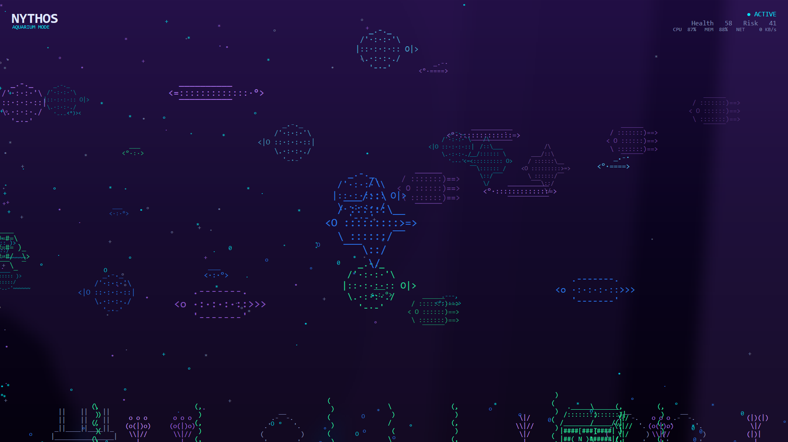

# Nythos — Aquarium Mode

An immersive **cyberpunk ASCII aquarium** for the Nythos desktop app. It runs as
a splash screen, idle screensaver, background dashboard, demo, or conference
kiosk — and it's **driven by live endpoint telemetry**, so the tank visibly
reflects the health of the machine. Built in Python with CustomTkinter + Pillow.



## Run

```powershell
cd C:\AI_LAB\projects\Screensaver
python -m aquarium                    # windowed (dev / background dashboard)
python -m aquarium --mode fullscreen  # splash sequence + fullscreen experience
python -m aquarium --mode screensaver # fullscreen, exits on any input
python -m aquarium --mode kiosk       # conference / demo machine
```

Requires `customtkinter`, `pillow`, `psutil` (all already installed here).

## Install as a program (standalone .exe)

Build a self-contained `NythosAquarium.exe` (no Python needed to run it) and
install it per-user with Start Menu / Desktop shortcuts and an uninstall entry:

```powershell
cd C:\AI_LAB\projects\Screensaver
pwsh -ExecutionPolicy Bypass -File build_exe.ps1        # -> dist\NythosAquarium.exe (~32 MB)
pwsh -ExecutionPolicy Bypass -File install_aquarium.ps1 # install + shortcuts (no admin)
```

`install_aquarium.ps1` copies the exe to `%LOCALAPPDATA%\Programs\NythosAquarium`,
creates **Start Menu › Nythos** ("Nythos Aquarium" = fullscreen, "… (Dashboard)" =
windowed) and a Desktop shortcut, and registers an entry under **Settings › Apps**.
Uninstall from there, or run `uninstall_aquarium.ps1`. The exe also accepts the
mode flags directly, e.g. `NythosAquarium.exe --mode screensaver`.

Packaging files: [build_exe.ps1](../build_exe.ps1) (PyInstaller),
[install_aquarium.ps1](../install_aquarium.ps1),
[packaging/make_icon.py](../packaging/make_icon.py) (app icon).

## Controls

| Key | Action | Key | Action |
|-----|--------|-----|--------|
| `Esc` | exit | `F` / `F11` | toggle fullscreen |
| `F2` | drop to windowed dashboard (any mode) | `H` | toggle HUD |
| `M` | toggle audio | | |
| `T` | demo a threat (spawns the predator) | `S` | manual sonar sweep |
| `W` | summon a whale | `+` / `-` | add / remove a fish |

**Easter eggs:** Konami code → fish become dragons · type `fredo` → scuba diver
with a glowing laptop · type `mythos` → giant phoenix silhouette · type `debug`
→ FPS / entity counts / telemetry / memory overlay.

## How telemetry drives the tank

`telemetry.py` polls real metrics with psutil on a background thread:

| Signal | Effect in the aquarium |
|--------|------------------------|
| CPU load | fish liveliness + current strength; `busy` state |
| Memory / process pressure | feeds the composite **risk score** |
| Network spike | a **sonar sweep** expands; fish investigate |
| Risk score > threshold (or `T`) | **threat** state: water darkens & reddens, a predator spawns, schools scatter, glitch burst |
| periodic | **AI analysis beam** scans a "suspicious" fish, then it returns to normal |

> This is the integration seam for the real product: replace `Telemetry._sample()`
> with the Nythos agent feed (threat detections, open ports, service/app
> inventory, endpoint health score) and every visual reacts automatically — the
> aquarium is data-driven, never random, whenever live data exists.

## Architecture

A modular, mode-agnostic engine. The renderer knows nothing about "fish"
specifically, so future scenes (Space, Forest, Data Center, Quantum, Cloud,
Cyber City) can be added by swapping the water-layer generator and entity set.

```
aquarium/
  config.py / settings.py     palette, tunables, JSON persistence
  ascii_art.py                art library (marine life + decor, mirror())
  ascii_generator.py          procedural fish (parts, colour, personality)
  entities.py                 Entity base + Fish (boids: cohesion/align/sep/flee)
  predators.py                Shark (threat predator, hunts + scatters schools)
  fauna.py                    jellyfish, turtle, octopus, stingray, whale, shrimp
  decor.py                    reef floor: coral, seaweed, treasure, ruins, rocks
  particles.py                bubbles + drifting motes (pooled, stochastic)
  camera.py                   cinematic drift + breathing zoom
  effects.py                  sonar / AI beam / glitch / alert pulse
  telemetry.py                live psutil snapshot (Nythos feed seam)
  renderer.py                 Pillow water layer + pooled Canvas entity layer
  scene.py                    world + security-state machine
  engine.py                   timing loop + smoothed FPS
  hud.py                      brand/status HUD + debug overlay
  splash.py                   startup loading sequence
  easter_eggs.py              hidden key sequences
  audio.py                    optional sonar pings (toggleable, safe no-op)
  app.py / __main__.py        CustomTkinter shell + run modes
```

### Performance design
- **Pillow water layer** rendered at reduced resolution + Gaussian blur, blitted
  as one Canvas image and regenerated at ~12 Hz (slow drift hides the low rate).
- **Item pooling** for entities/particles — items are repositioned, never
  recreated, so allocations stay flat for 24/7 operation (no leaks).
- Telemetry polling is off the UI thread; the render loop never blocks.
- Frame-paced via `after()` with a clamped delta-time and smoothed FPS readout.

## Scope: implemented vs. roadmap

**Implemented:** all four run modes, splash sequence, procedural ASCII fish with
boids behaviour + personalities, predator/threat state, sonar + AI-beam +
glitch + alert-pulse effects, jellyfish/turtle/octopus/stingray/whale/shrimp,
reef decor (coral/seaweed/treasure/ruins/rocks), bubbles/motes, camera drift,
live telemetry mapping, cyber HUD + debug overlay, all listed easter eggs,
toggleable audio, JSON settings.

**Roadmap (spec stretch goals):** OpenGL-accelerated backend for very high entity
counts, true bloom/depth-blur/caustics shaders, seamless looping ambient audio
bed, sea-turtle/whale parallax depth layers with reflections, a settings UI
panel, and the additional scenes (Space / Forest / Data Center / Quantum /
Cloud / Cyber City) on the existing renderer abstraction.
